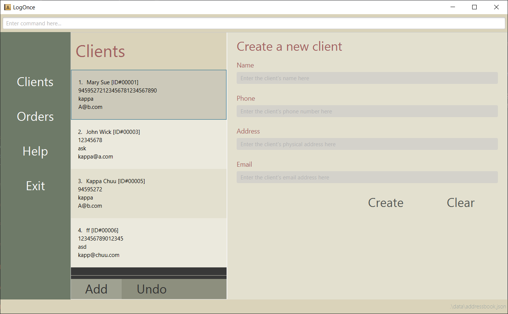
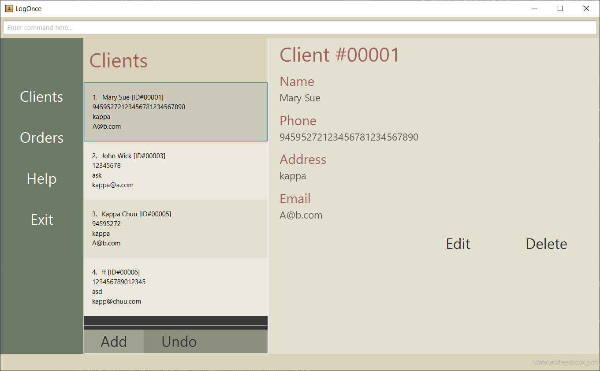
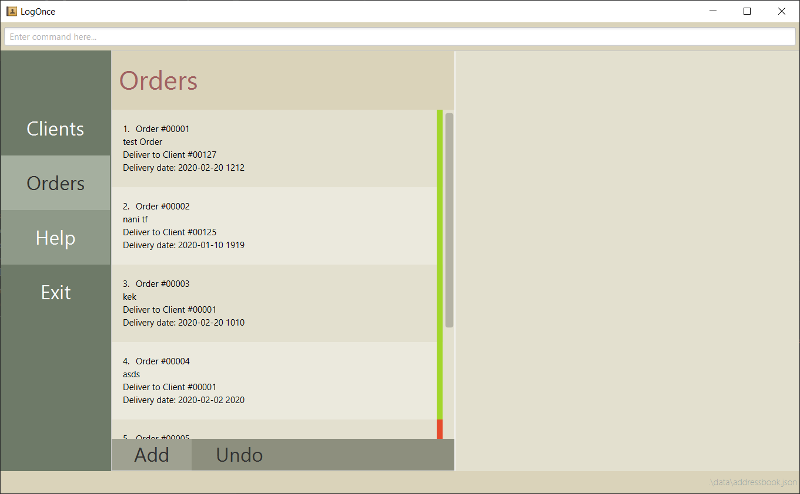
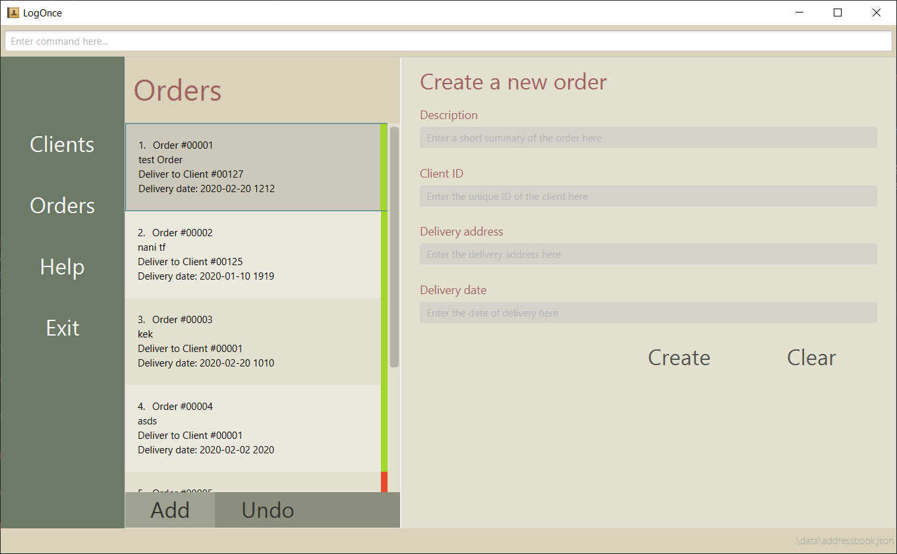
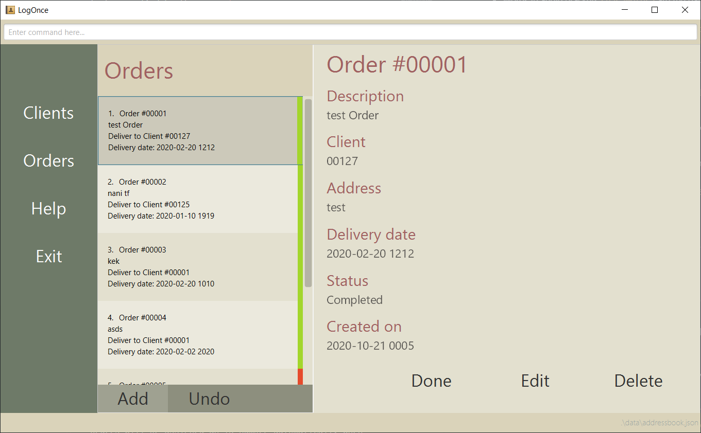
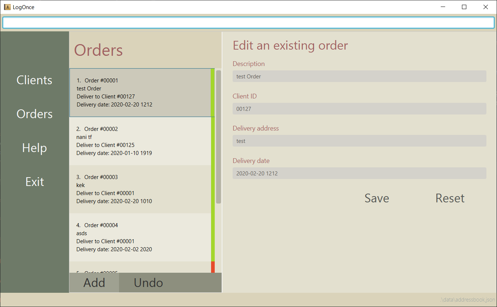
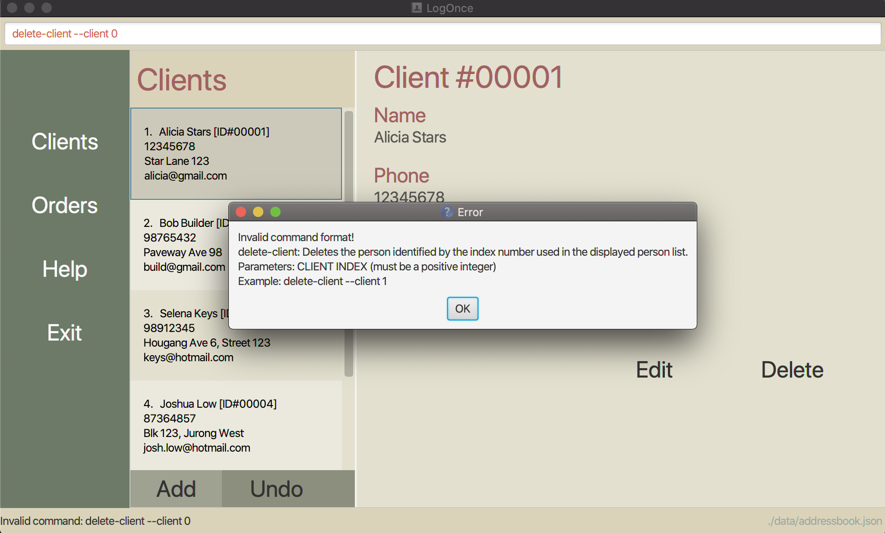
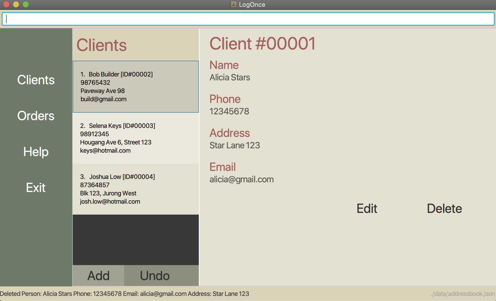
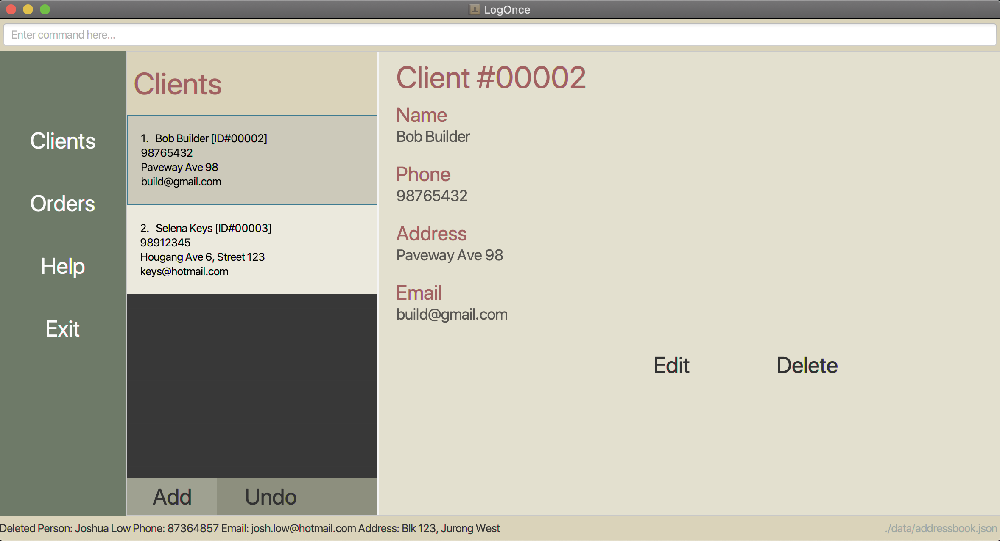
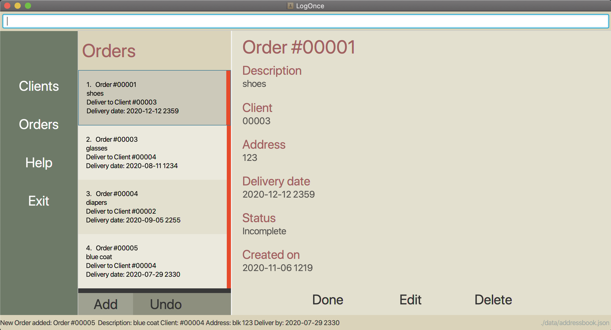

# LogOnce

**LogOnce** is a one-stop logistics tracker app for clerks to monitor shipping statuses of all clients and perform common logistics operations. It is optimized for use via a Command Line Interface (CLI) while still having the benefits of a Graphical User Interface (GUI). If you can type fast, LogOnce can get your tracking tasks done faster than traditional GUI apps. **This application is currently being developed and has not been deployed yet.**

* Table of Contents
{:toc}

--------------------------------------------------------------------------------------------------------------------

## Features

**:information_source: Notes about the command format:** 

* Words in angle brackets `<parameter>` are the parameters to be supplied by the user. 
  e.g. in `order --description <order description --client <client ID>`, `<client ID>` is a integer parameter such as `123`.

* Words with `--` before them indicate keywords that must be used unless otherwise specified. 
  e.g. `order --description Wooden Table --client 301`. `--description` and `--client` must be typed used.
  
* Words within `()` indicate optional keywords or tokens (most notably for `find` and `findorder`)

* In the case of duplicate parameters, the very last instance of the parameter will be used. 
  e.g. `delete-order --order 00001 --order 00002 --order 00003` will delete Order #00003 instead of the other two 
  orders.

## Graphical User Interface (GUI)
------------------------------------------------------------------------------------------------------------------------
Upon opening the application, you will be met with something like the scene below.

Click on the `Clients` button to navigate back to this page, or click on the `Orders` button to navigate to the orders page.

### View the list of clients

The first thing you see when clicking on `Clients` from anywhere in the application is a list of all clients currently stored in the application.

### Creating a new client

To create a new client, click on the `Add` button to bring up the Client creation form.

Fill in all the fields in the form, then click on `Create` to create the client. If there are errors in the input, or if any of the fields are empty, a warning will be displayed in red beside the relevant field.

### Viewing client information

To view more information about a client, **double-click** on a client in the list to bring up the information panel.

Click on the `Edit` button to edit the currently selected client, or click on the `Delete` button to delete the currently selected client.

### Editing the client

To modify the client's information, click on the `Edit` button from the client's information panel. This will bring up a form to edit the client's information.

The form will be filled in with the client's current information by default. Make any changes you need to, then click on `Save` to save your changes.

If you wish to discard any unsaved changes to the client's information, click on `Reset` to reset each field to the client's original information.

### Deleting the client

To delete the client, click on the `Delete` button from the client information panel. The client will be deleted, and their entry will be removed from the list of clients.

### View the list of orders

Upon clicking on the `Orders` button on the left navigation bar, the list of orders will be displayed.

### Creating a new order

To create a new order, click on the `Add` button at the bottom of the list of orders. This will bring up the order creation form.

Fill in all the fields in the form, then click on `Create` to create the order. If there are errors in the input, or if any of the fields are empty, a warning will be displayed in red beside the relevant field.

### Viewing order information

To view more information about a order, **double-click** on a order in the list to bring up the information panel.

Click on the `Edit` button to edit the currently selected order, or click on the `Delete` button to delete the currently selected order.

### Editing the order

To modify the order's information, click on the `Edit` button from the order information panel. This will bring up a form to edit the order's information.

The form will be filled in with the order's current information by default. Make any changes you need to, then click on `Save` to save your changes.

If you wish to discard any unsaved changes to the order information, click on `Reset` to reset each field to the order's original information.

### Mark an order as completed 

To mark an order as complete, click on the `Done` button from the order information panel. The status of the order will change from "Incomplete" to "Completed", and the red bar will turn to green.

If the order is already completed, clicking on the `Done` button will throw an error, but will not affect the status of the order.

### Deleting the order

To delete the order, click on the `Delete` button from the order information panel. The order will be deleted, and the corresponding entry will be removed from the list of orders.

### Undoing an action

In the event that you made a mistake in the previous command/edit/creation action, simply click on the Undo button at the bottom bar of the middle panel in order to undo your last action. You can undo all actions up to the point where you first opened the application.

### Help

Click on the `Help` button on the left navigation bar to bring up pop-up window will appear with a button that will allow you to copy the link into your clipboard.

To access the User Guide, simply copy the link into your browser and visit it.

### Exit

Click on the `Exit` button on the left navigation bar to quit the application. Data will be saved automatically on exit.

## Commands
------------------------------------------------------------------------------------------------------------------------

### Adding an Order : `order`

**Description** : Creates an order made by a client. The order of the orders made by the client will be (by default) the natural ordering. 
Orders will be assigned an ID number automatically when created. This ID number is not unique and must be used in conjunction with the client ID to identify an order.

**Format** :  `order --description <order description> --client <client ID> --address <address> --date <date of delivery>` 

`<order description>` must exist in the order command

`<client id>` must exist in the order command (an order is always linked to a client)

`<address>` must exist in the order command (describes the address that the order will be sent to)

**Remark** : 
`<date of delivery>` must exist in the order command, and must follow the ***YYYY-MM-DD HHmm*** format (describes the date the order must be delivered by) 
`<address>` can be different from the client's own address

**Example** : 
`order --description shoes --client 123 --address 22 college avenue drive --date 2020-10-31 2359` : creates an order ordered by client 123 called “shoes” that is to be delivered to "22 college avenue drive" by "2020-10-31 2359"

------------------------------------------------------------------------------------------------------------------------

### Adding a Client : `client`

**Description** : Creates a new client with the name `<client name>`, the address `<client address>`, the email `<client email>` and 
the phone number `<client phone number>`.

**Format** : `client --name <client name> --address <client address> --email <client email> --phone <client phone no.>`
  
`<client name>` must not be blank. 
`<client address>` must not be blank.  
`<client email>` must not be blank.  
`<client phone>` must not be blank.

**Example** : 
`client --name John Wick --address New York Continental --email johnwick@kgoomail.com --phone 91234567` : 
adds a client named John Wick whose address is the New York Continental, whose email is johnwick@kgoomail.com and 
whose phone number is 91234567.

------------------------------------------------------------------------------------------------------------------------

### Listing Orders : `list-order` 

**Description** : Returns a list of orders. The list will be sorted by the order ID that was assigned when the order was created.

**Format** : `list-order` 
Displays a list of all orders in the order list (and the client that placed the order respectively).

------------------------------------------------------------------------------------------------------------------------

### Listing Clients : `list-client`

**Description** : Returns a list of clients. The list will be sorted by the client ID that was assigned when the client was created.

**Format** : `list-client` 
Displays a list of all clients in the client list.

------------------------------------------------------------------------------------------------------------------------

### Undo Commands : `undo`

**Description** : Restores the address book to the state before the previous undoable command was executed.

**Format** : `undo` 
 
------------------------------------------------------------------------------------------------------------------------

### Deleting an Order : `delete-order`

**Description** : Deletes an order from order list.

**Format** : `delete-order --order <order id>`

Deletes the order that is identified as `<order id>`. 

Note that `<order index>` is the **unique order ID** given to each order when added and is **not** based on the order 
index in the order list.

`<order id>` must exist as a valid unique order ID in the order list, **starting from `1`**.

To identify the unique order ID of a client, view the 6 digit ID number assigned to the order to the **right** of 
the client's name. For example, if the first line of the order information is `2. Order #000005`, then the 
order's unique order ID is `5`.

**Invalid Usage Example** :

Order index should be a valid unique order ID in the order list

**Valid Usage Example** :

`delete-order --order 2` : deletes the order with unique order ID #000002

**Other Valid Usages** :
Entering order ID with as many leading zeroes (e.g `00000000001`) will still work as long as the order id without the
leading zeroes (e.g `1`) is a valid unique client ID in the client list.

------------------------------------------------------------------------------------------------------------------------

### Deleting a Client : `delete-client`

**Description** : Deletes a client from client list and orders linked to that client.

**Format** : `delete-client --client <client id>`

Deletes the client who is identified as `<client id>` and orders linked to `<client id>`. 

Note that `<client id>` is the **unique client ID** given to each client when added and is **not** based on the client 
index in the client list. 

`<client id>` must exist as a valid unique client ID in the client list, **starting from `1`**.

To identify the unique client ID of a client, view the 6 digit ID number assigned to the client in **brackets** beside 
the client's name. For example, if the first line of the client information is `1. Kim Kardashian [ID#000003]`, then the 
client's unique client ID is `3`.

**Invalid Usage Example** :

Client ID should be a valid unique client ID in the client list

**Valid Usage Example 1** : Deleting Client with Empty Order List

`delete-client --client 1` : deletes the client with unique client ID #000001
In this case, no orders are deleted as no orders are linked to the client

**Valid Usage Example 2** : Delete Client with Non-Empty Order List

`delete-client --client 4` : deletes the client with unique client ID #00004

Original Order List :

After client #00004 is deleted :

All orders in order list that are linked to client with unique ID `#00004` are deleted

**Other Valid Usages** :
Entering client ID with as many leading zeroes (e.g `00000000001`) will still work as long as the client id without the 
leading zeroes (e.g `1`) is a valid unique client ID in the client list.

------------------------------------------------------------------------------------------------------------------------

### Completing Orders : `done`

**Description** : Marks a certain order as done.

**Format** : `done <order id>`

Marks `Order` with `<order id>` as done.

`<order id>` must exist in the order list.
`<order id>` is a unique number assigned to each order.

**Example** : 
`done 3` : Marks the order with an order ID of 3 as complete (#00003 as represented in the GUI).

------------------------------------------------------------------------------------------------------------------------

### Finding clients : `find`

**Description** : Finds clients by their name and optionally by their phone number, email address and residential address.

**Format** : `find <name keywords> (--address <address keywords>) (--email <email address>) (--phone <phone number>)`

This command will return clients that match all the tokens provided. The matching criteria for each token
will be explained below.

If any of the optional tokens are present, `<name keywords>` may be left blank.

`<name keywords>` is any amount of keywords, each separated by a space. A client's whose name contains any of these
keywords will be considered a match. For example: `find alex chungus`. Both `Alex Rider` and `Big Chungus` will be
considered matches.

`<address keywords>` is any amount of keywords, each separated by a space. The matching of these keywords works the same
as it does for `<name keywords>`. For example: `find --address jurong clementi` will display clients that have their
address as `Jurong West`, `Jurong East`, `Clementi Avenue 6`, `Clementi Mall`.

`<email address>` is a string that should be a valid email address. The email address has to be an
 exact match for the client to be displayed. For example: `find --email doe@gmail.com`. 
 
`<phone number>` is a string of numbers only with a minimum length of 3. The phone number also has to be an exact match
for the client to be displayed. For example: `find --phone 99223344`.

More examples:
`find alice --phone 9123 --address changi` will display any clients with 'Alice' in their names, with a phone number of 
9123 and who live in Changi. This would be a very specific search, as phone numbers must be an exact match.

`find bob charles --address queenstown commonwealth` will display any clients with either 'Bob' or 'Charles' in their names who also
live in Queenstown or Commonwealth. This would be a more general search, as each client only has to match one keyword in
each category of searching.

------------------------------------------------------------------------------------------------------------------------

### Finding orders : `findorder`

**Description** : Finds orders by their description and optionally by their attached client IDs, delivery addresses and delivery dates.
Very similar usage to `find`

**Format** : `findorder <description keywords> (--address <address keywords>) (--date <date>) (--client <client ID>)`

This command will return orders that match all the tokens provided. The matching criteria for each token
will be explained below.

If any of the optional tokens are present, `<description keywords>` may be left blank.

`<description keywords>` is any amount of keywords, each separated by a space. An order whose description contains any of these
keywords will be considered a match. For example: `findorder iphone` will display all orders involving iPhones.

`<address keywords>` is any amount of keywords, each separated by a space. Functions the same as it does in `find` except
for orders.

`<client ID>` is an integer that should be greater than 0. The ID has to be an exact match for the order to be displayed.
For example: `findorder --client 1` will show all orders that are related to the client with an ID of 1.
 
`<date>` is a string of numbers separated by dashes in the format of `YYYY-MM-DD`. The date entered has to be valid and an
exact match for the order to be displayed. For example: `findorder --date 2020-11-27` will display all orders to be
delivered on the 27th of November, 2020.

### Editing/Updating orders: `update-order`
**Description** : Modifies a specified order with the new information provided in this command.

**Format** : `update-order --orderid <order ID of order to be changed> (--description <new order description>) (--clientid <new client id>) (--address <new address>) (--date <new delivery date>)`

This command will update the data fields of the order with the new information given in the command. The criteria for each field is similar to the criteria for the fields in `order`, and are given below.

Each of these fields are optional, and their parameter tags may be left out of the command if desired.

`<order ID of order to be changed>` must be an existing order ID.

`<new order description>` should not be blank.

`<new client id>` must be a client ID of an existing client.

`<new address>` should not be blank.

`<new delivery date>` should not be left blank, and must be in the format `YYYY-MM-DD HHmm`.

### Editing/Updating clients: `update-client`
**Description** : Modifies a specified client with the new information provided in this command.

**Format** : `update-client --clientid <client ID of client to be changed> (--name <new name>) (--phone <new phone number>) (--address <new address>) (--email <new email>)`

This command will update the data fields of the client with the new information given in the command. The criteria for each field is similar to the criteria for the fields in `client`, and are given below.

Each of these fields are optional, and their parameter tags may be left out of the command if desired.

`<client ID of client to be changed>` should consist of only positive numbers, and should correspond to the client ID of an existing client.

`<new name>` should not be blank.

`<new phone>` should not be blank, and should be at least 3 digits long and must be a positive number.

`<new address>` should not be blank.

`<new email>` should not be blank, and should be of a valid email format.

--------------------------------------------------------------------------------------------------------------------

### Help Command : `help`

**Description** : Displays a help window with the URL link to LogOnce's User Guide.

**Format** : `help`

This command allows you to copy the URL link to LogOnce's user guide for reference to the available commands which can 
be used in the application.

--------------------------------------------------------------------------------------------------------------------

## Command summary

Action | Format
--------|------------------
**Order** | `order --description <order description> --client <client ID> --address <address> --date <date>`
**Client** | `client --name <client name> --address <client address>`
**Delete** | `delete-order --order <order id>`   `delete-client --client <client id>`
**List** | `list-order`   `list-client`  
**Done** | `done --order <order id>`
**Find** | `find <name keywords> (--address <address keywords>) (--email <email address>) (--phone <phone number>)`
**FindOrder**| `findorder <description keywords> (--address <address keywords>) (--date <date>) (--client <client ID>)`
**Undo**| `undo`
**Update Order** | `update-order --orderid <order ID of order to be changed> (--description <new order description>) (--clientid <new client id>) (--address <new address>) (--date <new delivery date>)`
**Update Client** | `update-client --clientid <client ID of client to be changed> (--name <new name>) (--phone <new phone number>) (--address <new address>) (--email <new email>)`
**Help** | `help`
