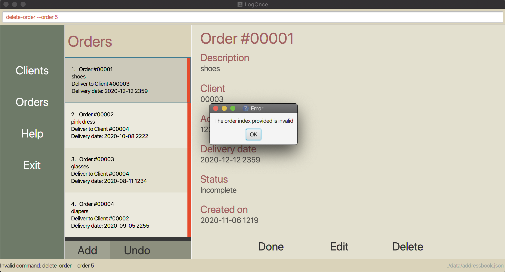

# LogOnce

**LogOnce** is a one-stop logistics tracker app for clerks to monitor shipping statuses of all clients and perform common logistics operations. It is optimized for use via a Command Line Interface (CLI) while still having the benefits of a Graphical User Interface (GUI). If you can type fast, LogOnce can get your tracking tasks done faster than traditional GUI apps. **This application is currently being developed and has not been deployed yet.**

* Table of Contents
{:toc}

--------------------------------------------------------------------------------------------------------------------

## Features

**:information_source: Notes about the command format:** 

* Words in angle brackets `<parameter>` are the parameters to be supplied by the user. 
  e.g. in `order --description <order description --client <client ID>`, `<client ID>` is a integer parameter such as `123`.

* Words with `--` before them indicate keywords that must be used. 
  e.g. `order --description Wooden Table --client 301`. `--description` and `--client` must be typed used.

* Words with `-` before them indicate tokens that are optional and change the functionality of the command. 
  e.g `list -a`. `-a` is a token that allows the `list` command to list completed orders in addition to current pending orders.

------------------------------------------------------------------------------------------------------------------------

### Adding an Order : `order`

Creates an order made by a client. The order of the orders made by the client will be (by default) the natural ordering. 
Orders will be assigned an ID number automatically when created. This ID number is not unique and must be used in conjunction with the client ID to identify an order.

Format : `order --description <order description> --client <client ID> --address <delivery address> --date <date of delivery>`

`<order description>` must exist in the order command

`<client id>` must exist in the order command (an order is always linked to a client)

`<address>` can be different from the client's own address

`<date of delivery>` must be in the format YYYY-MM-DD HHmm

Example :
`order --description shoes --client 123 --date 2020-02-10 1800` : creates an order ordered by client 123 called “shoes”
to be delivered on the 10th of February, 2020 at 6pm.

------------------------------------------------------------------------------------------------------------------------

### Adding a Client : `client`

Creates a new client with the name `<client name>`, the address `<client address>`, the email `<client email>` and 
the phone number `<client phone number>`.

Format : `client --name <client name> --address <client address> --email <client email> --phone <client phone no.>`
  
`<client name>` must not be blank. 
`<client address>` must not be blank.  
`<client email>` must not be blank.  
`<client phone>` must not be blank.

Example : 
`client --name John Wick --address New York Continental --email johnwick@kgoomail.com --phone 91234567` : 
adds a client named John Wick whose address is the New York Continental, whose email is johnwick@kgoomail.com and 
whose phone number is 91234567.

------------------------------------------------------------------------------------------------------------------------

### Listing Orders : `list` 

Returns a list of orders. The token `-a` can be used to list completed orders as well. 

Format : `listO` 
Displays a list of all orders in the order list (and the client that placed the order respectively)

Format: `listC` 
Displays a list of all clients in the client list 

`list -a` 
Displays a list of current orders, and past orders (completed)

------------------------------------------------------------------------------------------------------------------------

### Deleting a Client : `delete-client`

**Description** : Deletes a client from client list.

**Format** : `delete-client --client <client index>`

Deletes client that has `<client index>` as its index in the client list. 

Note that `<client index>` is not the unique client id given to each client when added. 

`<client index>` is determined solely from the client list indexing, which **starts from `1`**.

`<client index>` must exist as a valid index in the client list, **starting from `1`**.

**Invalid Usage Example** :

Client index should be a valid index in the client list

**Valid Usage Example** :

`delete-client --client 1` : deletes the client with client index 1

------------------------------------------------------------------------------------------------------------------------

### Deleting an Order : `delete-order`

**Description** : Deletes an order from order list.

**Format** : `delete-order --order <order index>`

Deletes order that has `<order index>` as its index in the order list. 

Note that `<order index>` is not the unique order id given to each order when added. 

`<order index>` is determined solely from the order list indexing, which **starts from `1`**.

`<order id>` must exist as a valid index in the order list, **starting from `1`**.

**Invalid Usage Example** :

Order index should be a valid index in the order list

**Valid Usage Example** :

`delete-order --order 2` : deletes the order with order index 2

------------------------------------------------------------------------------------------------------------------------

### Completing Orders : `done`

Marks a certain order as done.

Format : `done --order <order id>`

Marks `Order` with `<order id>` as done.

`<order id>` must exist in the order list.
`<order id>` is based on the index number of orders in the GUI window.

Example :
`done --client 10 --order 3` : deletes the order no. 3 of client with client id 10 

------------------------------------------------------------------------------------------------------------------------

## Command summary

Action | Format
--------|------------------
**Order** | `order --description <order description> --client <client ID>` 
**Client** | `client --name <client name> --address <client address>`
**Delete** | `delete-order --order <order index>`   `delete-client --client <client index>`
**List** | `listC`   `listO`   `list -a`
**Done** | `done --order <order id>`
